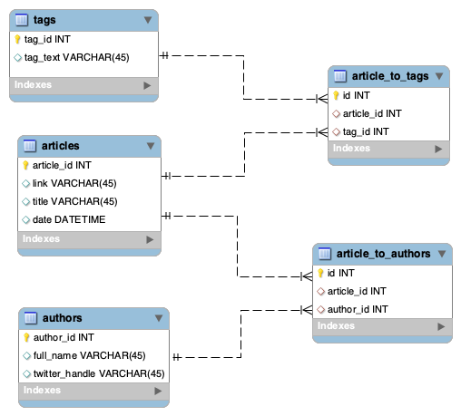

# **TechCrunch Web Scraper**

### Authors: [Daniella Grimberg](https://github.com/danigrim) and [Eddie Mattout](https://github.com/emattout)

## **Description**

Web scraper for TechCrunch. Scrapes main page and accesses all articles, printing out their title, date published and the tags associated with the article. Loads more pages of articles until user quits program or no more articles available.

## **Requirements & Installations**

Use the package manager [pip](https://pip.pypa.io/en/stable/) to install required packages.

```python
pip3 install -r requirements.txt
```

Install [chromedriver](https://chromedriver.chromium.org/downloads) specific to your chrome version. 

## **Instructions & Usage Options (Command-Line Interface)**

### Setting up database (first time use)

1. Clone repository
2. Unzip installed chromedriver and insert it into your project folder
3. **For first time use, you must setup the database. On your Terminal run the following commands:**

```python
mysql -u root -p 
#enter your password
mysql> CREATE SCHEMA techcrunch_cp_2;
#exit mysql
```

  4. Run the scraper with the make database option set to true in order to initiate the tables.

```python
#Final step
python3 main.py --make_db=True 

# Observe default behavior of scraper when it is scraping for all articles with 
# no constraints and adding them to a database. 
```

### Command Line Interface Usage Options

```python
  --tags TEXT        Option to scrape subset of tags (separated by commas, no
                     spaces). Default: all 
**Example: python3 main.py --tags=gaming,fintech**

  --authors TEXT     Option to scrape subset of authors (format: name_lastname
                     separated by commas, no spaces). Default: all 
**Example: python3 main.py --authors=Julian_Willson,Martha_Janes**

  --today BOOLEAN    Option to scrape only todays articles. Default:False

**Example: python3 main.py --today=True**

  --months TEXT      Option to scrape only articles from specified
                     months(number indexes separated bycommas, no spaces)
                     Default: all 

**Example: python3 main.py --months=1,2**

  --display TEXT     Option to select information to display from tags, title,
                     author, twitter, date, count (separated by commas, no
                     spaces) Default: all 

**Example: python3 main.py --display=tags,title**

  --limit INTEGER    Option to limit number of articles. Default: None
  
**Example: --limit=250**

  --make_db BOOLEAN  Option to initialize database and create necessary
                     tables. set to True in first time running scraper.
                     
**Example: python3 main.py --make_db=True**

  --help             Show this message and exit.
```

```python
#Example:
python3 main.py --display=tags,count,title --limit=10 --months=10,11 --today=False --authors=mary_johnson,john_doe --tags=blockchain,gaming
```

## Database ERD



### Tables

- Tags
    1. tag_id: Primary Key (Integer) . 
    2. Tag_text: The specific tag included in the article (String)
- Articles
    1. Article_id: Primary key identifying the article (Integer)
    2. Link: link to the article (String)
    3. Title: title of article (String)
    4. Date: date when article was published (Datetime)
- Authors
    1. Author_id: primary key identifying the author (Integer)
    2. Full_name: full name of the author (String)
    3. Twitter_handle: twitter handle of the author (String)
- Article to tags
    1. Creates a one to many relationship between articles and tags
- Article to authors
    1. Creates a one to many relationship between authors and articles
